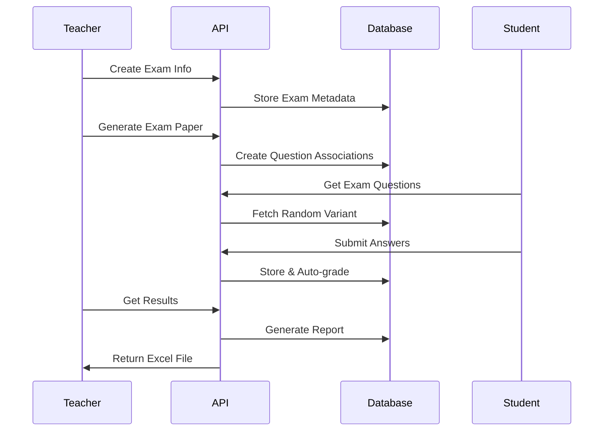

# ExamEdu - Online Examination Management System

<div align="center">


### A comprehensive exam management platform built with ASP.NET Core 5.0

[](https://dotnet.microsoft.com/)
[](https://www.postgresql.org/)
[](https://redis.io/)
[](https://dotnet.microsoft.com/apps/aspnet/signalr)

[Features](#-features) • [Tech Stack](#-tech-stack) • [Getting Started](#-getting-started) • [API Documentation](#-api-documentation) • [Architecture](#-architecture)

</div>

---

##  Overview

ExamEdu is a robust, enterprise-grade examination management system designed for educational institutions. It streamlines the entire examination lifecycle from question bank management to real-time exam proctoring, automated grading, and comprehensive reporting.

###  Key Highlights

-  **Real-time Exam Proctoring** - Live monitoring with SignalR and cheating detection
-  **Automated Grading Engine** - Instant MCQ evaluation with configurable marking schemes
-  **Smart Question Bank** - Hierarchical question organization with approval workflows
-  **Dynamic Exam Generation** - Auto-generate exam variants with customizable difficulty levels
-  **Role-Based Access Control** - Granular permissions for students, teachers, and administrators
-  **Comprehensive Reporting** - Excel export with charts and detailed analytics

---

##  Features

<table>
<tr>
<td width="33%" valign="top">

###  For Students
- Personal exam schedule
- Intuitive exam interface
- Real-time mark viewing
- Live notifications

</td>
<td width="33%" valign="top">

###  For Teachers
-  Question bank management
-  Auto exam generation
-  Real-time proctoring
-  Essay grading
-  Advanced analytics

</td>
<td width="33%" valign="top">

###  For Admins
-  Bulk account creation
-  Class management
-  System oversight
-  Access control

</td>
</tr>
</table>

###  Technical Features
-  RESTful API with Swagger documentation
-  JWT authentication with refresh tokens
-  Redis caching for real-time features
-  Automated email notifications
-  Cloud image storage (ImgBB)
-  Document management (MEGA)
-  SignalR WebSocket for live updates

---

##  Tech Stack

<table>
<tr>
<td>

**Backend Framework**
- ASP.NET Core 5.0
- C# 9.0

**Database**
- PostgreSQL
- Entity Framework Core 5.0

**Caching & Real-time**
- Redis
- SignalR

</td>
<td>

**Authentication**
- JWT Bearer
- BCrypt

**File Processing**
- EPPlus (Excel)
- MegaApiClient

**Mapping & Validation**
- AutoMapper
- Data Annotations

</td>
</tr>
</table>

---

##  Getting Started

### Prerequisites
```bash
.NET 5.0 SDK or later
PostgreSQL 12+
Redis Server
```

### Installation

**1. Clone the repository**
```bash
git clone https://github.com/yourusername/examedu.git
cd examedu
```

**2. Configure application settings**

Create `appsettings.json` in the root directory:
```json
{
  "ConnectionStrings": {
    "Postgre": "Host=localhost;Database=examedu;Username=postgres;Password=yourpassword"
  },
  "Jwt": {
    "Key": "your-secret-key-must-be-at-least-32-characters-long"
  },
  "Email": {
    "MailAddress": "your-email@gmail.com",
    "MailPassword": "your-app-password",
    "MailPort": 587,
    "MegaPassword": "your-mega-password"
  },
  "Redis": {
    "ConnectionString": "localhost:6379",
    "Database": 0
  },
  "FrontEndUrl": "http://localhost:3000",
  "FrontEndDevUrl": "http://localhost:3000"
}
```

**3. Restore dependencies**
```bash
dotnet restore
```

**4. Apply database migrations**
```bash
dotnet ef database update
```

**5. Run the application**
```bash
dotnet run
```

The API will be available at `https://localhost:5001`  
Swagger UI at `https://localhost:5001/swagger`

---

##  API Documentation


>  **Full API documentation** is available via Swagger at `/swagger` when running the application.

---

##  Architecture

### System Architecture


### Design Patterns & Principles

| Pattern | Implementation |
|---------|---------------|
| **Repository Pattern** | Service layer abstracts data access |
| **DTO Pattern** | Clean separation between entities and API |
| **Dependency Injection** | Constructor injection throughout |
| **Middleware Pipeline** | Custom exception handling & CORS |

### Package Diagram


---

##  Security Features

| Feature | Implementation |
|---------|---------------|
| **Authentication** | JWT with configurable expiration |
| **Session Management** | Refresh token mechanism |
| **Password Security** | BCrypt hashing with salt |
| **Authorization** | Role-based access control (RBAC) |
| **CORS** | Whitelist configuration |
| **Input Validation** | Data annotations & model state |
| **SQL Injection** | EF Core parameterization |

---

##  Key Functionalities

### Automated Exam Generation
```csharp
// Auto-generate exam with customizable parameters
CreateExamAutoInput input = new()
{
    ExamId = examId,
    VariantNumber = 3,  // Create 3 different versions
    NumberOfMCQuestionByLevel = new() 
    { 
        {1, 10},  // 10 easy MCQs
        {2, 5}    // 5 medium MCQs
    },
    NumberOfNonMCQuestionByLevel = new() 
    { 
        {1, 2},   // 2 easy essay questions
        {2, 1}    // 1 medium essay question
    },
    MarkByLevel = new() 
    { 
        {1, 1.0m},   // 1 mark per easy question
        {2, 2.0m}    // 2 marks per medium question
    }
};
```

###  Real-time Exam Proctoring
```csharp
// SignalR hub for live monitoring
await _notifyHub.Clients
    .Group($"teacher{examId}")
    .SendAsync("StudentCheatingNotify", studentEmail);

// Track student disconnections
await _notifyHub.Clients
    .Group($"teacher{examId}")
    .SendAsync("StudentDisconnect", studentEmail);
```

###  Excel Report Generation
```csharp
// Generate comprehensive exam reports with charts
var stream = await _examService.GenerateExamMarkReport(examId, classModuleId);
return File(stream, 
    "application/vnd.openxmlformats-officedocument.spreadsheetml.sheet", 
    "ExamReport.xlsx");
```

---

##  API Workflow Examples

### Complete Exam Lifecycle


---

##  Testing
```bash
# Run unit tests
dotnet test

# Run with coverage
dotnet test /p:CollectCoverage=true
```
---

##  License

This project is licensed under the MIT License - see the [LICENSE](LICENSE) file for details.

---

## Author

**Kane Thuong**

[](https://linkedin.com/in/yourprofile)
[](mailto:your.email@example.com)
[](https://yourwebsite.com)

---

## Acknowledgments

- [Entity Framework Core](https://docs.microsoft.com/ef/core/) - Robust ORM functionality
- [SignalR](https://dotnet.microsoft.com/apps/aspnet/signalr) - Real-time communication
- [EPPlus](https://github.com/EPPlusSoftware/EPPlus) - Excel file manipulation
- [AutoMapper](https://automapper.org/) - Object mapping
- The ASP.NET Core community for excellent documentation and support

---

## Project Stats


---

<div align="center">

### ⭐ If you find this project useful, please consider giving it a star!

**Made with ❤️ for the education community**

</div>
